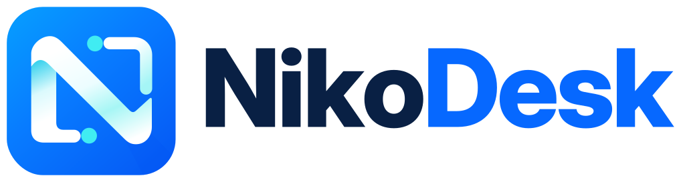
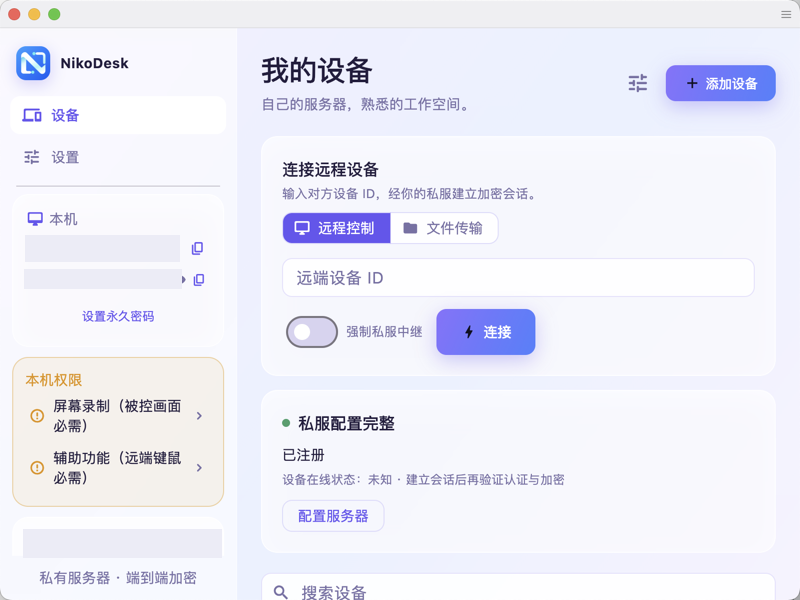
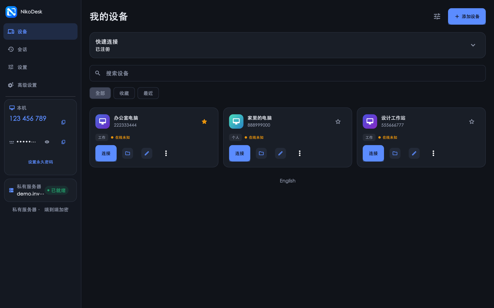

<div align="center">



# NikoDesk

**Your server. Your keys. Your desk.** — a self-hosted, private-by-design remote desktop built on the RustDesk core.

[](https://github.com/baogutang/nikodesk/releases)
[](https://github.com/baogutang/nikodesk/releases)
[](LICENSE)
[](https://github.com/baogutang/nikodesk/stargazers)

**English** · [简体中文](README_zh.md) · [Website](https://baogutang.github.io/nikodesk/)

 

*Light (gradient glass) and dark (night console) themes — both ship in one app.*

</div>

---

## Why NikoDesk

Public remote-desktop services route your screen, keystrokes and files through servers you don't control. NikoDesk flips the model: it only ever talks to **the rendezvous/relay server you configure** (e.g. [rustdesk-server](https://github.com/rustdesk/rustdesk-server) on your own NAS or VPS), and it refuses to fall back to any public server. Session content is end-to-end encrypted between peers; your server only brokers the handshake.

| | NikoDesk | Typical SaaS remote desktop |
|---|---|---|
| Signal path | Your private server only | Vendor cloud |
| Public-server fallback | **Refuses, by design** | Default |
| Controller policy | Never connects without the remote password | Passwordless "ask" flows |
| Update channel | GitHub Releases, SHA256-verified | Vendor auto-update |
| Self-hosting | Point it at your hbbs/hbbr | N/A |

## Features

- **🔒 Private-server only** — validated ID/relay/key configuration; no public rendezvous fallback, ever.
- **🗝️ Password-gated controlling** — a session is never dispatched with a device ID alone. The remote password is entered client-side; empty passwords are refused before any handshake.
- **🖥️ Real remote control** — full RustDesk core: remote control, file transfer, clipboard, multi-display, hardware codecs (VP8/VP9/AV1/H.264/HEVC).
- **🌗 Dual themes** — a light "soft gradient + glass" skin and a dark "night console" skin, following your system with a manual override.
- **📱 Device workspace** — device cards with real rendezvous-backed online status, aliases, groups, favorites, and honest "availability unknown" states.
- **🕓 Session history** — local, capped, integrity-checked history of sessions you initiated (initiation ≠ remote acceptance — we don't overstate).
- **🔎 Diagnostics & permissions** — private-server registration status, latency/NAT, and guided macOS screen-recording/accessibility grants.
- **⬆️ Verifiable updates** — check for updates from the app; downloads come from GitHub Releases over HTTPS and are **SHA256-verified before anything is replaced**.
- **🚫 Hard-disabled by policy** — terminal, port forwarding, camera, remote restart, privacy mode and local-input blocking are compiled out of this product.

## Getting started

1. Grab the latest [release](https://github.com/baogutang/nikodesk/releases) (`v1.0.0` ships macOS ARM64, Windows x64 and Android ARM64).
2. **macOS**: drop `NikoDesk.app` into `/Applications`, then grant *Screen Recording* and *Accessibility* in **System Settings → Privacy & Security** (the app guides you), and relaunch once.
3. Run your own [rustdesk-server](https://github.com/rustdesk/rustdesk-server) (hbbs/hbbr). In NikoDesk → **Settings → Private server**, enter your ID server, relay and the server's public key.
4. On your controllers (official RustDesk clients work), set the same server, then connect to your NikoDesk device ID **with its password**.

> Already running stock RustDesk? NikoDesk uses an isolated bundle id, config directory and IPC namespace — the two coexist without touching each other.

## Update flow

Settings → **Software update → Check for updates**. The app queries `api.github.com` (HTTPS, host-allowlisted), compares versions, shows the release notes, downloads the platform bundle, **verifies the published SHA256**, swaps `/Applications/NikoDesk.app` and relaunches. Windows/Android show a download link for the same release.

## Build from source

```bash
git clone https://github.com/baogutang/nikodesk.git
cd nikodesk/flutter && flutter pub get
flutter build macos --release   # requires the Rust core; see CI for the full matrix
```

The complete, reproducible toolchain (pinned Rust, Flutter 3.24.5, vcpkg native deps) is exercised on every tag by [`.github/workflows/release.yml`](.github/workflows/release.yml).

## Security notes

- Sessions are end-to-end encrypted; the private server only performs rendezvous and optional relay.
- Receiver-side permissions are per-session, visible in the confirmation window, and revocable live (keyboard/mouse/clipboard/file/audio).
- The updater is fail-closed: no SHA256SUMS asset or digest mismatch ⇒ nothing is installed.
- No telemetry, no account, no third-party network calls. Hosts contacted: your server, `api.github.com`/`github.com` (update checks only).
- Release builds carry local signatures (no Apple Developer ID/notarization). For wide distribution, sign with your own certificate.

## Documentation

- [Website](https://baogutang.github.io/nikodesk/) — features, guides and downloads.
- Upstream's original README is preserved at [`docs/README_RUSTDESK_UPSTREAM.md`](docs/README_RUSTDESK_UPSTREAM.md).

## Acknowledgments

NikoDesk is a product-grade downstream of [RustDesk](https://github.com/rustdesk/rustdesk) (baseline commit `e9ddbd8f`, 1.5.0-pre), which provides the entire remote-control core. Huge thanks to the RustDesk authors and contributors; upstream clipboard security fixes have been backported locally.

## License

[AGPL-3.0](LICENSE) — inheriting RustDesk's license. Derivative works must remain open-source under the same terms.
